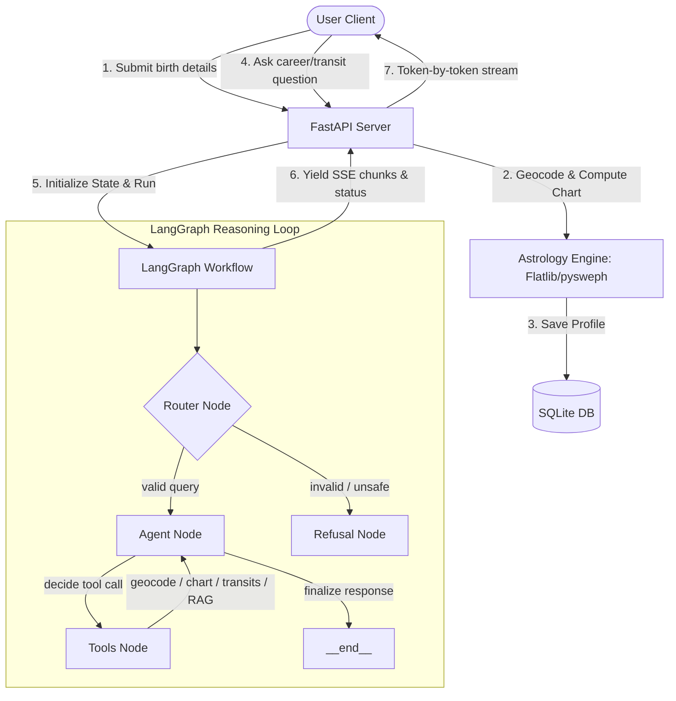

# AstroAgent 🌌

AstroAgent is a premium AI-driven astrological consultation platform. It integrates astronomical mathematical calculations (via `flatlib` and Swiss Ephemeris), geocoding/timezone resolvers, and advanced reasoning loops built on **LangGraph** to deliver deep, personalized, and psychologically grounded astrological insights.

---

## 🗺️ System Architecture



---

## 📁 Repository Structure

```text
astroagent/
├── backend/
│   ├── app/
│   │   ├── api/
│   │   │   ├── routes/      # Chat and birth details endpoints
│   │   │   └── schemas/     # Pydantic schemas
│   │   ├── database/        # SQLite models.py and sqlite.db
│   │   ├── graph/           # LangGraph builder, nodes, state, and edges
│   │   ├── services/        # LLM client, DB service, and SSE streaming
│   │   ├── tools/           # Geocode, birth chart, transits, and local RAG
│   │   └── main.py          # FastAPI application entrypoint
│   ├── evals/               # Evaluation datasets, judge prompts, and runner
│   ├── tests/               # Local test suite (tools, agents, patch verification)
│   ├── requirements.txt     # Python backend dependencies
│   └── .env                 # Environment configurations (API keys)
└── frontend/
    ├── src/
    │   ├── components/      # Birth details form, chat window, and tool activity
    │   ├── pages/           # Home Landing and Chat pages
    │   ├── store/           # Zustand state store (chatStore.js)
    │   ├── hooks/           # useStreaming.js EventSource hook
    │   └── App.jsx          # Screen switcher and session controller
    ├── tailwind.config.js   // Tailwind CSS configuration
    └── package.json         // Frontend dependencies
```

---

## 🛠️ Setup & Running Instructions

### 1. Environment Configuration
Create a `.env` file in the `backend/` directory:
```env
GROQ_API_KEY=your_groq_api_key
GROQ_MODEL=llama-3.3-70b-versatile
PORT=8000
HOST=0.0.0.0
```

### 2. Start the Backend
From the `backend/` directory:
```bash
# Initialize virtual environment
python -m venv venv
venv\Scripts\activate

# Install dependencies (incorporates pysweph and flatlib compatibility)
pip install -r requirements.txt
pip install pysweph
pip install flatlib --no-deps
pip install geopy timezonefinder tzdata

# Start FastAPI server
uvicorn app.main:app --reload
```
The server starts on `http://localhost:8000`.

### 3. Start the Frontend
From the `frontend/` directory:
```bash
# Install NPM packages
npm install

# Start Vite dev server
npm run dev
```
The client opens on `http://localhost:5173`.

---

## 🧪 Testing and Evaluations

### Local Integration Verification
Before running the full suite, verify that the router and agent tools execute without loops:
```bash
cd backend
venv\Scripts\python tests\test_agent.py
```

### Run Evaluation Suite
Execute the Golden Dataset runner (25 test cases graded via LLM-as-a-judge):
```bash
cd backend
venv\Scripts\python evals\run_eval.py
```
This writes individual test scores to `evals/results.csv` and outputs an ASCII evaluation report to `evals/scorecard.txt`.
